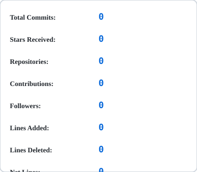
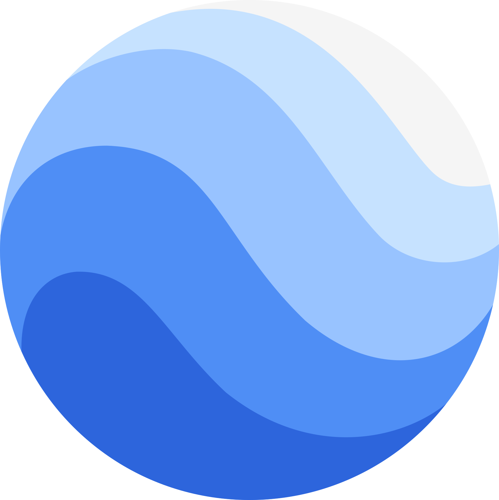
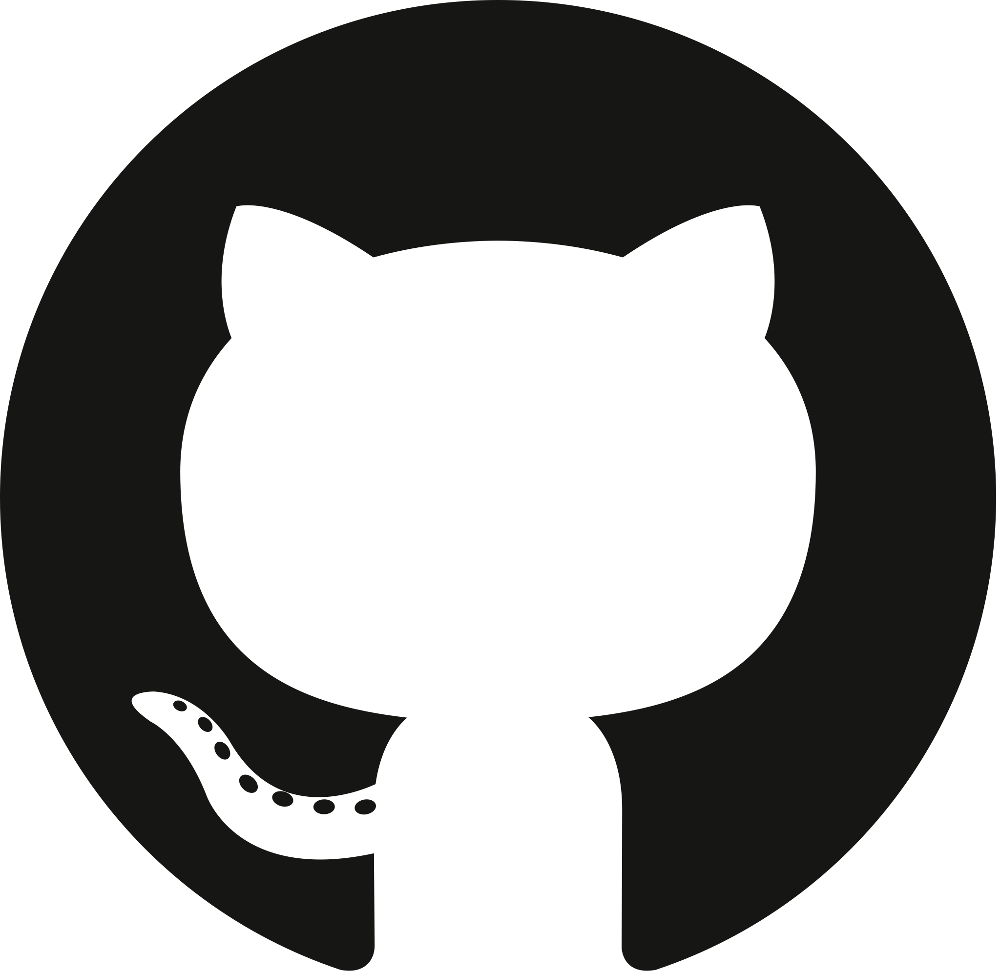
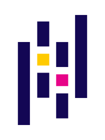
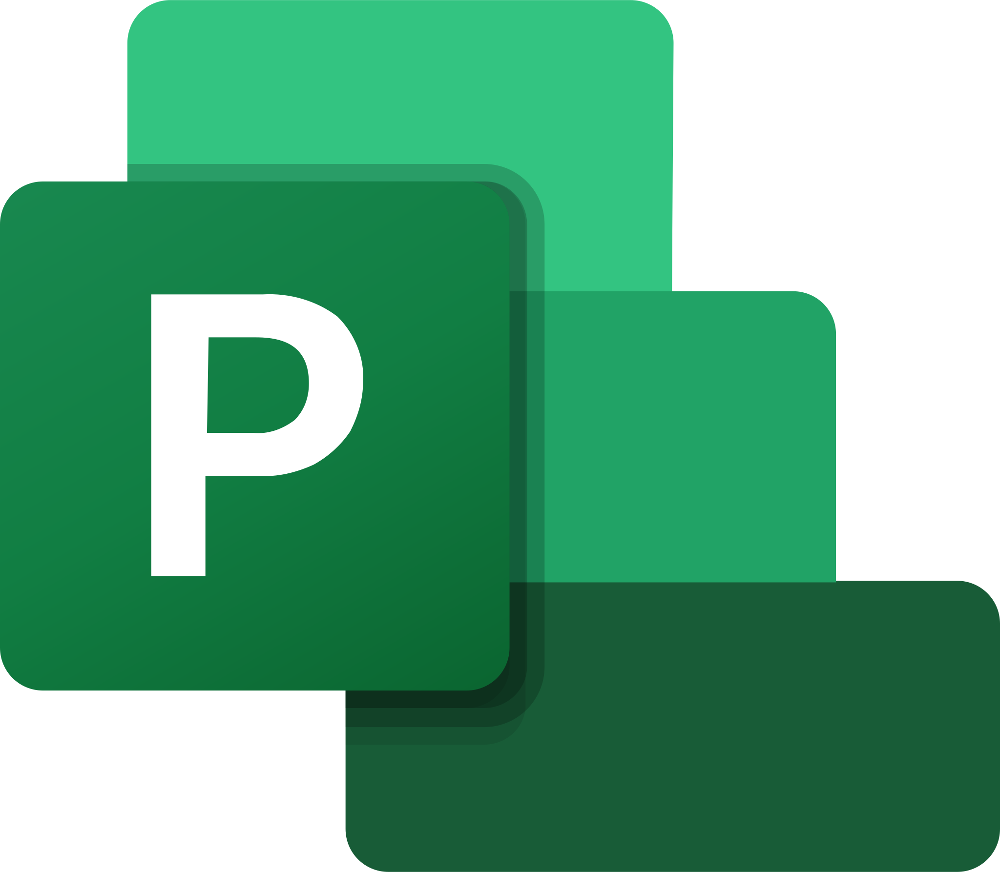
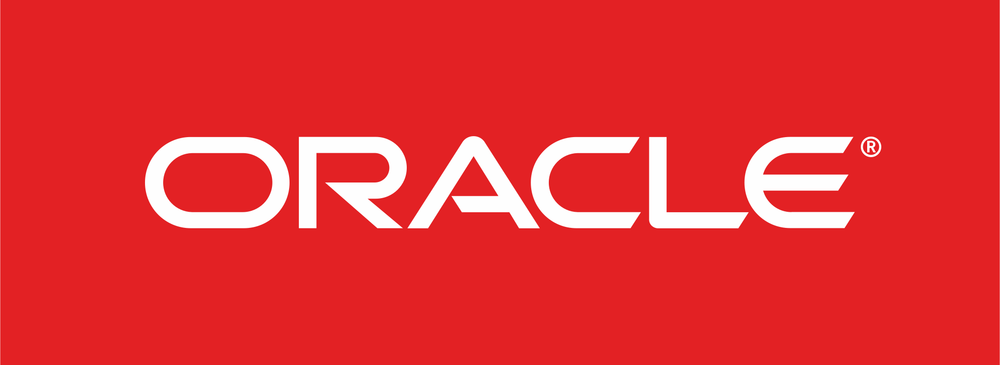

<a href="https://github.com/MKarimi21/MKarimi21">
  <picture>
    <source media="(prefers-color-scheme: dark)" srcset="dark_mode.svg">
    
  </picture>
</a>

  

<h3 align="center">Hi, I'm Mostafa Karimi &nbsp; </h3> 

 

           
              
 

   

 

<b>♠️ About Me! </b>

I am an Industrial Engineer specializing in Systems Optimization, passionate about bridging the gap between complex manufacturing processes and modern software solutions.
Currently, I serve as a Computerized Systems Expert at Moaddar Karan Engineering Co. (Turbine Blades Manufacturing). My expertise lies in implementing Business Process Management (BPM) systems and developing Manufacturing Execution Systems (MES). With a background in Inventory Planning, I have developed a profound understanding of shop-floor operations, supply chain, and maintenance workflows (EM/CM), which now serves as the foundation for my software architecture designs.
 
My vision is to build Smart Manufacturing systems that go beyond mere data collection. I am currently developing a comprehensive tracking and cost-calculation system that integrates mathematical optimization models (using Python & Pyomo) to enhance production planning and decision-making.
 
To achieve this, I am actively expanding my tech stack in Web and Mobile Development (React, Flutter, FastAPI) to create user-friendly, data-driven applications for both management and shop-floor operators.
Key Interests: 
 
🔹 Mathematical Modeling & Operations Research (Pyomo)  
🔹 MES/ERP Development & Process Automation  
🔹 Industrial AI & Predictive Maintenance  
🔹 Industrial Simulation (FlexSim) & Digital Twins  

 

<b>💪🏻 Programming Language & Frameworks that I am working on it till to expert on it, so maybe i need many time to fully expert in each one 😃 </b>
   
   
   
  
   
   
   
 

  
<b>And also I'm working on my Industrial Engineering skills 🤟🏻</b>
  
  
  
  

 
  
  
<a href="https://metrics.lecoq.io/about/mkarimi21"></img></a><a href="https://metrics.lecoq.io/about/mkarimi21"></img></a>

 
 

